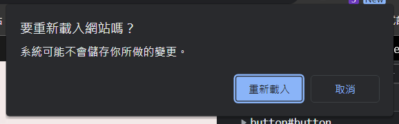
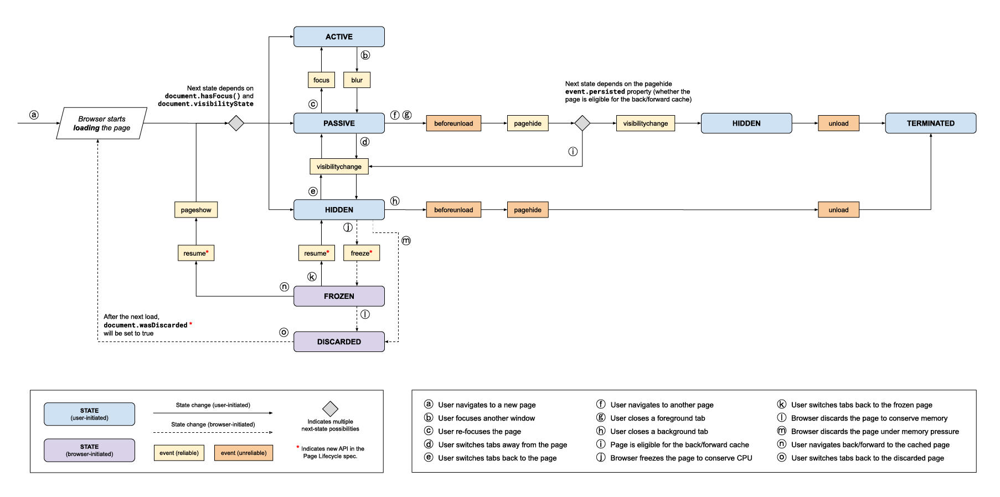

# DOMContentLoaded, load, beforeunload, unload 觸發時機

一個網頁從開啟到關閉，會有它完整的生命週期，這篇筆記就來介紹幾個網頁的生命週期 API :

- [`DOMContentLoaded`](https://developer.mozilla.org/en-US/docs/Web/API/Document/DOMContentLoaded_event)
- [`load`](https://developer.mozilla.org/en-US/docs/Web/API/Window/load_event)
- [`beforeunload`](https://developer.mozilla.org/en-US/docs/Web/API/Window/beforeunload_event)
- [`unload`](https://developer.mozilla.org/en-US/docs/Web/API/Window/unload_event)

## DOMContentLoaded

---

> `document.readyState 對應` `"interactive"`
> 

當 HTML 載入並完全解析完畢後，也就是 DOM Tree 建立完成，就會觸發 `DOMContentLoaded` 事件，但外部資源 ( 例如 : 圖片 ``、樣式表 stylesheets ) 可能還沒有完成載入。

### 使用方法

```javascript showLineNumbers
document.addEventListener('DOMContentLoaded', (event) => {
  // DOM fully loaded and parsed !
})
```

<br />

## load

---

> `document.readyState` 對應 `"complete"`
> 

當 HTML 載入並完全解析完畢後，並且所有外部資源 ( 例如圖片 ``、樣式表 stylesheets ) 也載入完畢後，才會觸發 `load` 事件。

### 使用方法

```javascript showLineNumbers
window.addEventListener('load', (event) => {
  // All resources finished loading !
})
// or
window.onload = (event) => {
  // All resources finished loading !
}
```

<br />

## beforeunload

---

在使用者離開這個頁面 ( 例如 : 轉導頁、上一頁、下一頁、關閉頁面 ) **之前**，會觸發 `beforeunload` 事件。

### 使用方法

```javascript showLineNumbers
window.addEventListener('beforeunload', () => {
  // When all resources about to be unloaded !
})
// or
window.onbeforeunload = function () {
  // When all resources about to be unloaded !
}
```

另外，有些網站在離開頁面時會彈出 confirm 視窗詢問是否要重新載入網站 :



當在事件方法 onbeforeunload 中使用以下方法，都會觸發這個確認視窗 :

```javascript showLineNumbers
// return 不為 undefined 或 null 皆會觸發確認視窗
window.onbeforeunload = function () { return false }
// or
// event.returnValue 賦予任何值，包括 undefined、null 皆會觸發確認視窗
window.onbeforeunload = function () { event.returnValue = '' }
```

<br />

## unload

---

在使用者離開這個頁面 ( 例如 : 轉導頁、上一頁、下一頁、關閉頁面 ) **之後**，會觸發 `unload` 事件，`unload` 會在 `beforeunload`、`pagehide` 事件之後觸發。

### 使用方法

```javascript showLineNumbers
window.addEventListener('unload', (event) => {
  // All resources unloaded !
})
// or
window.onunload = (event) => {
  // All resources unloaded !
}
```

:::caution
MDN 有[提及](https://developer.mozilla.org/en-US/docs/Web/API/Window/unload_event#usage_notes)應避免使用此 API，原因為下 :

- 移動設備無法可靠觸發 `unload` 事件。
- 有些瀏覽器若具有 `unload` 監聽事件，則不會將頁面放入 BFCache，不利於網頁效能。

可以使用 [`visibilitychange`](https://developer.mozilla.org/en-US/docs/Web/API/Document/visibilitychange_event)、[`pagehide`](https://developer.mozilla.org/en-US/docs/Web/API/Window/pagehide_event) 事件代替，但仍須注意 `pagehide` 雖然支援 BFCache，但在移動設備上仍然不可靠。
:::

<br />

## 延伸閱讀

---

Chrome Developers 這篇 [Page Lifecycle API](https://developer.chrome.com/blog/page-lifecycle-api/) 有更詳細的說明，這邊也附上文中事件對應圖 :



[點我看大圖](https://wd.imgix.net/image/eqprBhZUGfb8WYnumQ9ljAxRrA72/1mN2saGWo57O6vIOdcGy.svg)

<br />

## Reference

---

- [請說明 DOMContentLoaded, load, beforeunload, unload 的觸發時機 - 軟體工程師面試、職涯、新加坡生活分享 - ExplainThis](https://www.explainthis.io/zh-hant/interview-guides/frontend/fe-DOMContentLoaded-load-beforeunload-unload-difference)
- [重新認識 JavaScript 番外篇 (6) - 網頁的生命週期 - iT 邦幫忙::一起幫忙解決難題，拯救 IT 人的一天](https://ithelp.ithome.com.tw/articles/10197335)
- [Page: DOMContentLoaded, load, beforeunload, unload](https://javascript.info/onload-ondomcontentloaded)
- [Page Lifecycle API - Chrome Developers](https://developer.chrome.com/blog/page-lifecycle-api/)