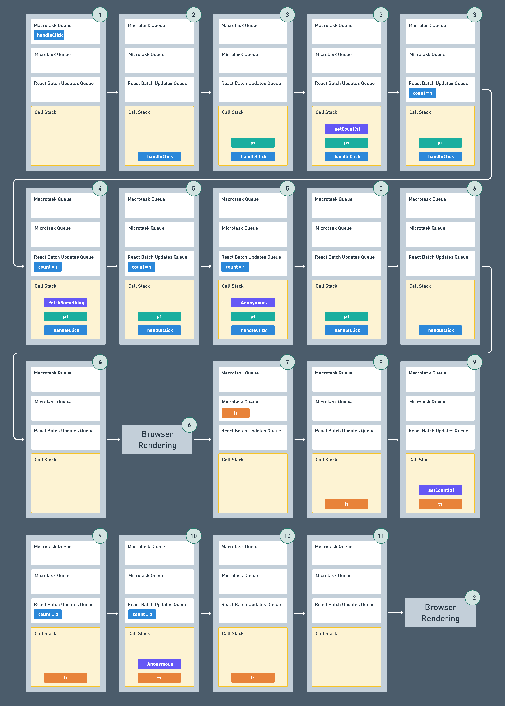
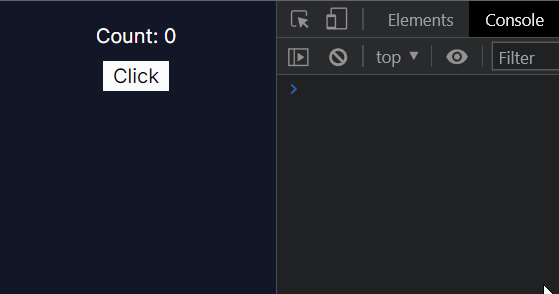

# 在非同步事件中的 re-render

這邊要先感謝這篇 **[派氏文件 - 元件渲染](https://piesdoc.com/zh-Hant/docs/react/component-rendering)** 的作者 [abemscac](https://github.com/abemscac)，因為我在這個 [小節](https://piesdoc.com/zh-Hant/docs/react/component-rendering#%E7%95%B6%E7%95%B0%E6%AD%A5%E5%87%BD%E5%BC%8F%E7%9A%84%E5%91%BC%E5%8F%AB%E8%80%85%E6%81%A2%E5%BE%A9%E5%9F%B7%E8%A1%8C) 的 re-render 次數一直很不解，最後跑去私訊問作者得到解答。

## React 的非同步事件

```jsx showLineNumbers title="App.js"
function fetchSomething() {
  return fetch('https://jsonplaceholder.typicode.com/todos/1')
}

function App() {
  console.log('[App rerender]')
  const [count, setCount] = useState(0)
  async function handleClick() {
    setCount(1)
    await fetchSomething()
    setCount(2)
  }

  return (
    <div>
      <div>Count: {count}</div>
      <button
        type="button"
        onClick={handleClick}
      >
        Click
      </button>
    </div>
  )
}
```

在上面的範例中，可以思考一下 App 元件一共重新渲染了幾次 ?

<details>
  <summary>執行結果</summary>
  <p>
    <strong>一共是 2 次</strong>
  </p>
  
  <p>( 灰色的 console.log 是 React Strict Mode 的產物 )</p>
</details>

我一開始蠻天真的，本來以為 React 18 會因為 batches state updates 的機制讓非同步程式碼也可以僅重新渲染一次，但事實上並不是如此，而且也說明我對 Event Loop 中 microtask 的機制並不是很熟悉。

### 先將 async / await 轉換成 Promise 釐清一下

根據 [MDN await 文件](https://developer.mozilla.org/en-US/docs/Web/JavaScript/Reference/Operators/await#control_flow_effects_of_await)，我們可以將上面程式碼中的 `handleClick` 方法轉換成 Promise 的形式 :

```jsx showLineNumbers
function handleClick() {
  return new Promise(function p1(resolve) {
    setCount(1)
    resolve(fetchSomething())
  }).then(function t1() {
    setCount(2)
  })
}
```

為了方便說明，我將 Promise 內的 callback 命名為 `p1`，`.then()` 的 callback 命名為 `t1`。

我們知道在 Promise 裡面的程式碼是**同步**執行，`.then(callback)` 裡面的 callback function 才會排定微任務，由此得知，`await` 後面的表達式會同步執行，以這個例子來說，就是 `fetchSomething()` 會同步執行。

而 `await` 之後的程式碼，也就是 `setCount(2)` 等於被放進 `.then(callback)` 的 callback function 裡面排定為**微任務**執行。

### 所以按下 button 到底發生了什麼事 ?

先附上宏任務及微任務的 event loop 簡化流程圖 :


接著分析一下點擊 button 觸發 `handleClick` 事件流程 :

```jsx showLineNumbers
function fetchSomething() {
  return fetch('https://jsonplaceholder.typicode.com/todos/1')
}

function handleClick() {
  return new Promise(function p1(resolve) {
    setCount(1)
    resolve(fetchSomething())
  }).then(function t1() {
    setCount(2)
  })
}
```

:::note
以下流程中的**執行**，皆是指將任務 ( task ) **放到 Call Stack 上執行**。
:::

1. 點擊 button，將 `handleClick` 排至宏任務佇列，此時宏任務佇列為 `[ handleClick ]`。
2. 從宏任務佇列拿出 `handleClick` 執行，這個 click event handler 會存在於 Call Stack 上直到`p1` 上所有 task 執行完畢才會移除。
3. 執行 `p1`，接著執行 `setCount(1)`，此時 React 的批次更新佇列 ( batch updates queue ) 從原本空的 `[ ]`，新增更新任務到佇列 `[ 取代為 1 ]`。
4. 執行 `fetchSomething()`，此時 Promise 狀態為 `Pending`。
5. 還沒結束，此時有一個 anonymous function 被推到 Call Stack 上執行，目的是執行 React 批次更新佇列 `[ 取代為 1 ]`，執行完畢後更新 state，觸發 React `App` 元件重新渲染 ( re-render )，注意 React 的重新渲染為 Virtual DOM 的重新繪製，不代表瀏覽器的渲染。
6. `p1` 皆執行完畢，`p1` 從 Call Stack 中移除，`handleClick` 也從 Call Stack 中移除，此時 Call Stack 為空，微任務佇列為空，觸發瀏覽器渲染一次。
7. 剛剛 `p1` 裡面的 `fetchSomething()` 得到回應，Promise 狀態為 `Fulfilled`，由 JavaScript 引擎將 `.then(t1)` 裡面的 `t1` 加入微任務佇列等待執行，此時宏任務佇列為 `[ ]`、微任務佇列為 `[ t1 ]`。
8. 檢查宏任務佇列為空；檢查微任務佇列 `[ t1 ]`，拿出 `t1` 執行。
9. 執行 `setCount(2)`，此時 React 的批次更新佇列從原本空的 `[ ]`，新增更新任務到佇列 `[ 取代為 2 ]`。
10. 執行 React 批次更新佇列的 anonymous function 被推到 Call Stack 上執行，執行完畢後更新 state，觸發 React `App` 元件重新渲染 ( re-render )。
11. `t1` 皆執行完畢，`t1` 從 Call Stack 中移除
12. 檢查微任務佇列為空，觸發瀏覽器渲染一次。

---

以上就是還原整個事件流程，這邊也附上模擬流程圖 ( 步驟中右上角數字代表上面流程執行的順序編號 ) :


[點我看大圖](./assets/asyncRerender/async-re-render-task.png)

<br />

## 延伸這個範例

我們還原了整個事件的流程，變化一下範例 :

```jsx showLineNumbers title="App.js"
function fetchSomething() {
  return fetch('https://jsonplaceholder.typicode.com/todos/1')
}

async function handleClick() {
  setCount(1)
  await fetchSomething()
  setCount(2)
  await fetchSomething()
  setCount(3)
  await fetchSomething()
  setCount(4)
  await fetchSomething()
  setCount(5)
}
```

有興趣可以拆解步驟還原整個 `handleClick` 事件流程，現在應該難不倒你了，觸發 `handleClick` 總共會造成 `App` 元件重新渲染幾次呢 ?

<details>
  <summary>執行結果</summary>
  <p>
    <strong>一共是 5 次</strong>
  </p>
  
</details>

<br />

因此要在 async 方法中避免元件重新渲染多次，可以這樣 :

```jsx showLineNumbers title="App.js"
function fetchSomething() {
  return fetch('https://jsonplaceholder.typicode.com/todos/1')
}

async function handleClick() {
  setCount(1)
  setCount(2)
  setCount(3)
  setCount(4)
  setCount(5)
  // 讓以上的 setState 方法 automatic batching
  await fetchSomething()
  await fetchSomething()
  await fetchSomething()
  await fetchSomething()
}
```

執行結果 :



<br />

## 總結

雖然我不知道這個議題在實務上會不會真的發生，但研究過程也蠻有趣的，讓我又複習了 Event Loop 一遍，不過呢，也許還原整個事件的流程可能有哪些地方有疑慮，如果有讀者發現哪裡不對的話，還請不吝嗇留言糾正我 (-ω-ゞ

<br />

## Reference

---

- [元件渲染 | Pies Doc](https://piesdoc.com/zh-Hant/docs/react/component-rendering)
- [await - JavaScript | MDN](https://developer.mozilla.org/en-US/docs/Web/JavaScript/Reference/Operators/await#control_flow_effects_of_await)
- [Promise 与微任务，你真的懂吗？](https://zhuanlan.zhihu.com/p/449183802)
- [React 源码解读之 Automatic Batching](https://juejin.cn/post/6978304166154207239)
- [给女朋友讲 React18 新特性：Automatic batching](https://zhuanlan.zhihu.com/p/382216973)
- [[Day 10] React 畫面更新的核心機制（上）：一律重繪渲染策略 - iT 邦幫忙::一起幫忙解決難題，拯救 IT 人的一天](https://ithelp.ithome.com.tw/articles/10298007)
- [[Day 11] React 畫面更新的核心機制（下）：Reconciliation - iT 邦幫忙::一起幫忙解決難題，拯救 IT 人的一天](https://ithelp.ithome.com.tw/articles/10298053)
- [深入探究 eventloop 与浏览器渲染的时序问题](https://juejin.cn/post/6844903487700992007)
