# 開始建置 Docusaurus !

Docusaurus 是由 Facebook 團隊開發的靜態網站生成框架，起初 Facebook 團隊在開發專案時使用 Jekyll 產生共同模板，並用複製的方式複製到新項目，但是後來發現這種複製的方式會讓各個項目失去更新的控制權，例如 Facebook 團隊想要為各個項目提供 i18n 支持功能時，就非常難以更新這個功能到其他已經被複製過去的項目中。

因此為了方便維護更新、擴充功能，並且可以讓使用者靈活調整網站主題，於是開發了 Docusaurus，Facebook 也表示 Docusaurus 可以讓沒有太多 Web 開發經驗的人用基本的網站展示他們的項目。

## 建立環境

---

- [Node.js](https://nodejs.org/en/) 版本 16.14 以上，推薦使用 [nvm](https://github.com/nvm-sh/nvm) 管理 Node.js 版本。

## 所需技能

---

- **Markdown 語法 :**
  如果不會的話也沒關係，Markdown 語法並不難上手，可以參考 [Markdown Guide](https://www.markdownguide.org/basic-syntax/) 文件，Docusaurus [官方文件](https://docusaurus.io/docs/markdown-features)也有相關的語法說明。
- **Terminal comman line :**
  因為 Docusaurus 是由 Node.js 驅動，需要輸入 npm 相關指令建置或者部署你的網站。
- **React :**
  不一定要會，但會 React 的話，就算只是基礎的 React 操作也可以很好的客製自己的網站。

## 建置步驟

---

### Step 1. 使用 `npx` 建立專案

```powershell
npx create-docusaurus@latest [部落格名稱] [模板選擇]
```

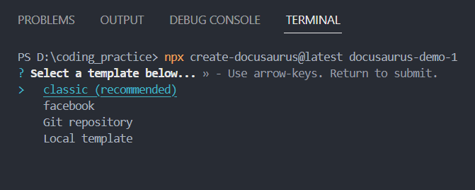

模板選擇可以先照官方推薦的 `classic` 建置即可。

若要使用 TypeScript 開發，可在結尾加上 `--typescript`

```powershell
npx create-docusaurus@latest [部落格名稱] [模板選擇] --typescript
```

此時 `npx` 指令會開始建置專案環境和安裝相關的套件

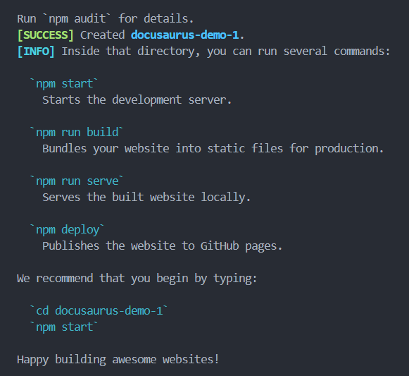

建置好後使用 `cd` 我們切換到該專案

```powershell
cd [部落格名稱]
```

或者直接在 VSCode 重新開啟專案。

<br />

### Step 2. 運行專案 ( development )

```powershell
npm run start
```

這個指令會在 `http://localhost:3000/` 本地端開啟網站，可以看到預設的 Docusaurus，在專案內存檔都可以及時更新內容 ( Hot reload )。

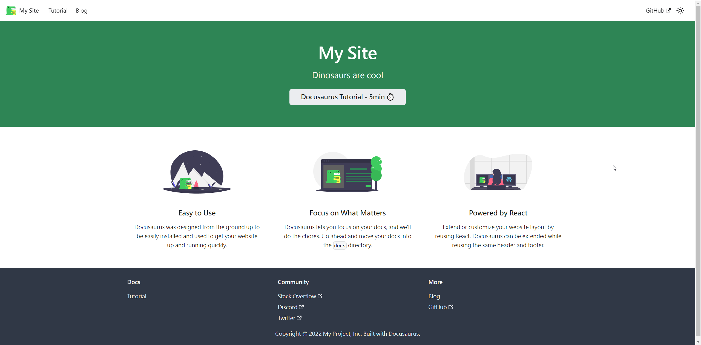

這樣就完成第一步了 ! 🎉

<br />

## 建立 GitHub Repo

---

:::note

請先安裝 [Git](https://git-scm.com/)，以及申請 [GitHub](https://github.com/) 帳號。

:::

為了保留專案的變動記錄，以及後續會介紹使用 Vercel 部署，將專案上傳到 GitHub repo 吧 !

### Step 1. 新增 repo

在 GitHub 右上角 “+” 打開選單點選 **New repository** 建立新的 repo。

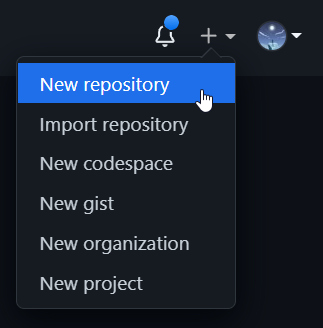

### Step 2. 輸入 repo 名稱並建立


<br />
<br />

建立完成後複製 repo 的 url :

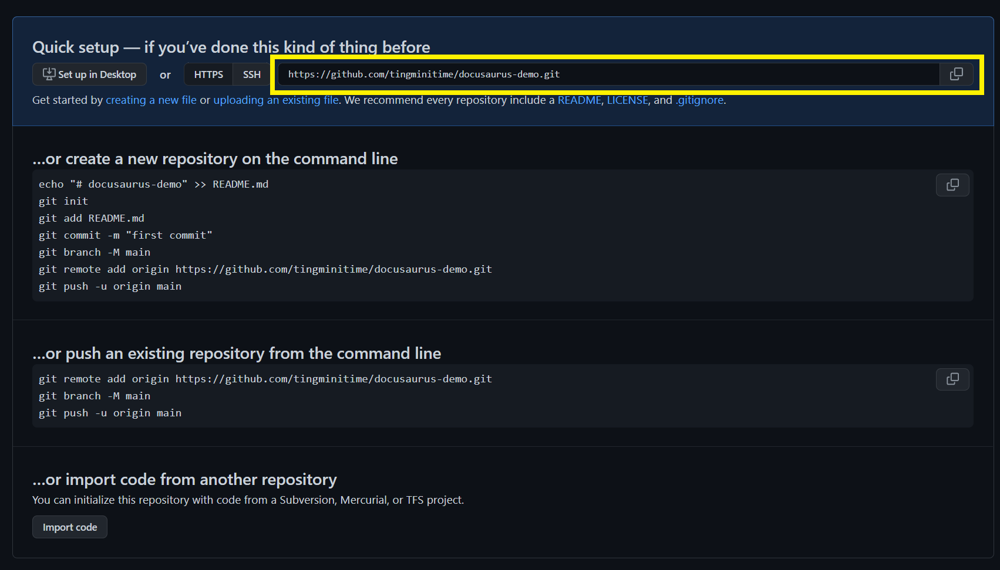

### Step 3. Git init

切回到 VSCode，`ctrl` + `~` 打開 Terminal，建議切換到 Git Bash

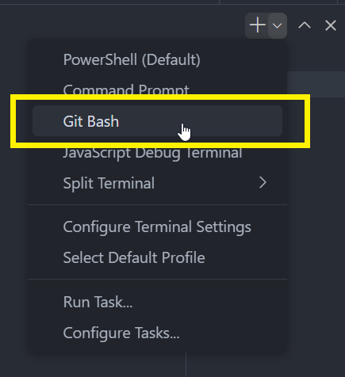

按照順序輸入以下命令 :

```bash showLineNumbers
git init
git add .
git commit -m 'first commit'
git branch -M main
git remote add origin [貼上剛剛複製的 repo url]
git push origin main
```

重新整理 GitHub repo 頁面，就會看到專案的檔案已經上傳囉 !


<br />
<br />

在這之後只要有新增、修改撰寫的文件或部落格，都建議使用 git 指令 commit 並上傳到 GitHub repo :

```bash showLineNumbers
git add .
git commit -m '新增:第一篇部落格'
git push origin main
```

<br />

## Docusaurus 專案架構說明

---

目前的專案檔案結構長這個樣子 :

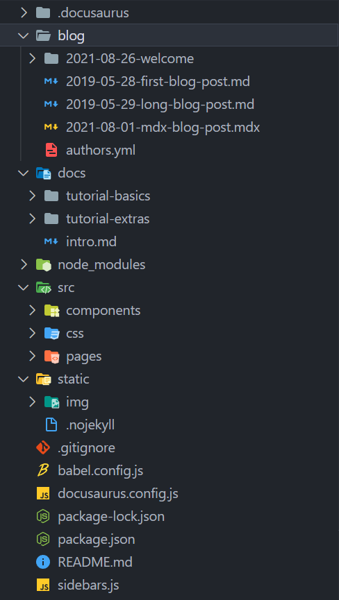

解讀如下 :

```
docusaurus-demo /
├── blog/
│   └── ... // 放部落格文章
├── docs/
│   └── ... // 放文件
├── node_modules/
│   └── ...
├── src/
│   ├── components/ // 元件檔案
│   │   └── ...
│   ├── css/ // 樣式管理
│   │   └── ...
│   └── pages/ // 頁面管理
│       └── ...
├── static/ // 靜態檔案管理
│   └── img/
│       └── ...
├── .gitignore
├── babel.config.js
├── docusaurus.config.js // docusaurus 的配置設定檔
├── package-lock.json
├── package.json // npm 套件及指令設定
├── README.md
└── sidebar.js // 側邊欄設定檔
```

- `blog/` - 所有部落格文章的放置處。
- `docs/` - 所有文件的放置處，會由自動生成側邊欄，如果需要自訂側邊欄可以在 sidebar.js 和 docusaurus.config.js 調整設置。( [官方文件說明](https://docusaurus.io/zh-CN/docs/sidebar) )
- `src/` - 管理 React 元件、css 樣式、md、mdx。
  - `src/pages/` - 支援將 `jsx`、`tsx`、`md`、`mdx` 轉換成頁面，並自動生成路由。
- `static/` - 管理靜態檔案，通常放置一些圖片檔、robots.txt 之類的，`npm run build` 後會直接複製到 `build` 資料夾底下。
- `docusaurus.config.js` - Docusaurus 的配置設定檔，通常愈需要客製自己的網站，愈需要頻繁調整這邊的配置，包含網站主題、網站 icon、部署、全站 `head`、`meta`、docs、blog、頂部導覽列、底部 footer、docusaurus 內建 plugins、第三方套件、Google analytics 等等相關設定。( [官方文件說明](https://docusaurus.io/zh-CN/docs/configuration) )
- `sidebar.js` - 側邊欄設定檔，可由自動生成側邊欄項目改為自訂項目。( [官方文件說明](https://docusaurus.io/docs/sidebar) )

:::info
💡 詳細架構說明可以參考此[官方文件](https://docusaurus.io/docs/installation#project-structure-rundown)。
:::

<br />

## Docusaurus 常用基本設定

---

### 網站名稱、連結、主要目錄

以 GitHub page 配置 :

```jsx showLineNumbers title="./docusaurus.config.js" title="./docusaurus.config.js"
const config = {
  title: 'Docusaurus Demo', // 網頁標題
  tagline: 'Dinosaurs are cool', // 網頁標語
  url: 'https://tingminitime.github.io', // GitHub page 基本 url
  baseUrl: '/docusaurus-demo/', // GitHub repo 名稱
  // ...
}
```

以 Vercel 配置 :

```jsx showLineNumbers title="./docusaurus.config.js"
const config = {
  title: 'Docusaurus Demo', // 網頁標題
  tagline: 'Dinosaurs are cool', // 網頁標語
  url: 'https://docusaurus-demo.vercel.app', // Vercel url
  baseUrl: '/',
  // ...
}
```

### 網站 icon

```jsx showLineNumbers title="./docusaurus.config.js"
const config = {
  // ...
  favicon: 'img/favicon.ico',
  // ...
}
```

網站 icon 位於 `./static/img/` 目錄底下，可自行更換。

### GitHub 部署設定

```jsx showLineNumbers title="./docusaurus.config.js"
const config = {
  // ...
  organizationName: '[你的 GitHub 名稱]', // Usually your GitHub org/user name.
  projectName: '[GitHub repo 名稱]', // Usually your repo name.
  // ...
}
```

### i18n 多國語系

若以繁體中文內容為主，沒有其他語系可以這樣設置 :

```jsx showLineNumbers title="./docusaurus.config.js"
const config = {
  // ...
  i18n: {
    defaultLocale: 'zh-Hant', // 預設語系
    locales: ['zh-Hant', 'en'], // 網站包含語系
  },
  // ...
}
```

若有支援多語系，可以這樣設置 :

```jsx showLineNumbers title="./docusaurus.config.js"
const config = {
  // ...
  i18n: {
    defaultLocale: 'zh-Hant', // 預設語系
    locales: ['zh-Hant', 'zh-Hans', 'en'], // 網站包含語系
    localeConfigs: {
      'zh-Hans': {
        label: '简体中文', // 更改語言下拉選單的顯示文字
        direction: 'ltr', // 書寫方向
        htmlLang: 'zh-Hans', // <html lang="..."> html lang 屬性語言
      },
      en: {
        label: 'English',
        direction: 'ltr',
        htmlLang: 'en-US',
      },
    },
  },
  // ...
}
```

設置完後在根目錄創建 `./i18n/` 資料夾，在依照語系分別建立資料夾，放入 docs 檔案，架構大概是這樣 :

```
docusaurus-demo /
└── i18n/
    ├── zh-Hans/
    │   └── ... // 簡體中文 docs
    └── en/
        └── ... // 英文 docs
```

然後在 `docusaurus.config.js` 將頂部導覽列的語系切換設定打開 :

```jsx {7-10} showLineNumbers title="./docusaurus.config.js"
const config = {
  // ...
  themeConfig: {
    navbar: {
      items: [
        // ...
        {
          type: 'localeDropdown',
          position: 'left',
        },
        // ...
      ],
    },
  },
  // ...
}
```

多語系更多教學可參考[官方文件](https://docusaurus.io/docs/i18n/tutorial)。

### Plugins 插件

```jsx showLineNumbers title="./docusaurus.config.js"
const config = {
  // ...
  plugins: [],
  // ...
}
```

若使用 Sass/SCSS，需先安裝相關套件 :

```powershell
npm install --save docusaurus-plugin-sass sass
```

加入到 `plugins` 設定中 :

```jsx showLineNumbers title="./docusaurus.config.js"
const config = {
  // ...
  plugins: ['docusaurus-plugin-sass'],
  // ...
}
```

### Presets 預置設定

```jsx showLineNumbers title="./docusaurus.config.js"
const organizationName = 'tingminitime'
const projectName = 'docusaurus-demo'

const config = {
  // ...
  presets: [
    [
      '@docusaurus/preset-classic',
      /** @type {import('@docusaurus/preset-classic').Options} */
      ({
        // docs 設定
        docs: {
          sidebarPath: require.resolve('./sidebars.js'),
          // "編輯此頁"對應的url，將此移除則不會顯示"編輯此頁"
          editUrl: `https://github.com/${organizationName}/${projectName}/tree/main/`,
          showLastUpdateTime: true, // 顯示更新時間 ?
          showLastUpdateAuthor: true, // 顯示更新作者 ?
        },
        // blog 設定
        blog: {
          showReadingTime: true, // 顯示預估閱讀時間
          editUrl: `https://github.com/${organizationName}/${projectName}/tree/main/`,
        },
        theme: {
          customCss: require.resolve('./src/css/custom.css'), // 全域 css 樣式
        },
      }),
    ],
  ],
  // ...
}
```

### 主題外觀

以下內容皆對應至 `config.themeConfig` 裡面 :

```jsx {8} showLineNumbers title="./docusaurus.config.js"
const config = {
  // ...
  themeConfig:
    /** @type {import('@docusaurus/preset-classic').ThemeConfig} */
    (
      {
        /* !! 這邊 !! */
      }
    ),
  // ...
}
```

- `colorMode` : 亮暗主題配置

```jsx showLineNumbers title="./docusaurus.config.js"
colorMode: {
  defaultMode: 'light', // 預設亮暗主題 : 亮
  disableSwitch: false, // 是否禁止切換 ?
  respectPrefersColorScheme: true, // 是否依照使用者 prefers-color-scheme 系統預設亮暗主題配置 ?
},
```

- `metadata` : 自訂 meta 內容

```jsx showLineNumbers title="./docusaurus.config.js"
metadata: [
  {
    name: 'robots',
    content: 'max-image-preview:standard',
  },
	// ...
],
```

- `image` : 自訂 `og:image`

```jsx showLineNumbers title="./docusaurus.config.js"
image: 'img/og-img.png',
```

- `navbar` : 頂部導覽列

```jsx showLineNumbers title="./docusaurus.config.js"
navbar: {
  title: 'My Site',
	hideOnScroll: false, // 向下滾動頁面是否隱藏頂部導覽列 ?
  logo: {
    alt: 'My Site Logo', // logo 圖片的 alt 屬性
    src: 'img/logo.svg', // 亮色主題的 logo 圖片
		srcDark: 'img/Tim-logo-white.svg', // 暗色主題的 logo 圖片
    style: { margin: '0 1rem' }, // logo 圖片的 inline-style
  },
  items: [
    {
      type: 'doc', // doc 類別
      docId: 'intro', // doc ID
      position: 'left', // 位於導覽列位置 left | right
      label: 'Tutorial', // 顯示文字
    },
    {
      to: '/blog', // 連結 url，type 為 default
      label: 'Blog',
      position: 'left',
    },
		{
      type: 'dropdown', // 下拉選單類別
      label: '更多',
      position: 'left',
      items: [ // 下拉選單項目
        {
          to: '/more/about',
          label: '關於我',
        },
        {
          to: '/support/privacy-policy',
          label: '隱私權政策',
        },
        // ...
      ],
    },
    {
      href: 'https://github.com/facebook/docusaurus',
      label: 'GitHub',
      position: 'right',
    },
  ],
},
```

更多頂部導覽列配置可參考[官方文件說明](https://docusaurus.io/docs/api/themes/configuration#navbar)。

- `docs` : 文檔主題設置

```jsx showLineNumbers title="./docusaurus.config.js"
docs: {
  sidebar: {
    hideable: true, // 是否顯示可隱藏側邊攔功能 ?
    autoCollapseCategories: false, // 是否在打開側邊攔項目時，自動收和其他已打開項目 ?
  },
},
```

- `footer` : 底部 footer 設置

```jsx showLineNumbers
footer: {
  style: 'dark', // 預設 dark 樣式 dark | light
  links: [ // 照內容水平分區塊，最多 12 欄會換列
    {
      title: 'Docs',
      items: [
        {
          label: 'Tutorial',
          to: '/docs/intro',
        },
      ],
    },
    {
      title: 'Community',
      items: [
        {
          label: 'Stack Overflow',
          href: 'https://stackoverflow.com/questions/tagged/docusaurus',
        },
        // ...
      ],
    },
    {
      title: 'More',
      items: [
        {
          label: 'Blog',
          to: '/blog',
        },
        {
          label: 'GitHub',
          href: 'https://github.com/facebook/docusaurus',
        },
      ],
    },
  ],
  copyright: `Copyright © ${new Date().getFullYear()} My Project, Inc. Built with Docusaurus.`,
},
```

- `prism` : 程式碼區塊主題設置

```jsx showLineNumbers title="./docusaurus.config.js"
prism: {
	defaultLanguage: 'javascript', // 預設語言 javascript，可更改
  theme: lightCodeTheme, // default
  darkTheme: darkCodeTheme, // default
	// 自定義高亮程式碼註解語法及class name
  magicComments: [
		// 若有自定義則記得將原有預設語法加上去
    {
      className: 'theme-code-block-highlighted-line',
      line: 'highlight-next-line',
      block: { start: 'highlight-start', end: 'highlight-end' },
    },
    {
      className: 'code-block-error-line', // 自定義 class name
      line: 'error-next-line', // 自定義程式碼區塊註解語法
    },
  ],
},
```

預設語言更改可參考 [這裡](https://prismjs.com/#supported-languages)。

<br />

## 使用 Sass/SCSS 更改樣式

---

先安裝相關套件 :

```powershell
npm install --save docusaurus-plugin-sass sass
```

加入到 plugins 設定中 :

```jsx showLineNumbers title="./docusaurus.config.js"
const config = {
  // ...
  plugins: ['docusaurus-plugin-sass'],
  // ...
}
```

preset 預置設定中的 `theme.customCss` 將路徑及副檔名 `./src/css/custom.css` 改為 `./src/scss/custom.scss`。

```jsx showLineNumbers title="./docusaurus.config.js"
const config = {
  // ...
  presets: [
    [
      '@docusaurus/preset-classic',
      /** @type {import('@docusaurus/preset-classic').Options} */
      ({
        // ...
        theme: {
          customCss: require.resolve('./src/scss/custom.scss'),
        },
        // ...
      }),
    ],
  ],
  // ...
}
```

這樣就可以在 `custom.scss` 中撰寫全域樣式囉 !

## 側邊攔自定義配置

---

在 `./docs/` 底下的資料夾裡面會發現有 `_category_.json` 這個檔案，這是目錄在側邊欄的設定檔 :

```json showLineNumbers title="_category_.json"
{
  "label": "Tutorial - Basics", // 目錄名稱
  "position": 2, // 在側邊攔排序位置
  "className": "custom-class-name", // 可在 ./src/css/custom.css 自訂樣式
  "link": {
    "type": "generated-index",
    "description": "5 minutes to learn the most important Docusaurus concepts."
  }
}
```

[官方文件說明](https://docusaurus.io/docs/sidebar/autogenerated#category-item-metadata)

<br />

## Docs-only

---

若想要只有文檔，不想要首頁、部落格，可以這樣設定 :

```jsx showLineNumbers title="./docusaurus.config.js"
const config = {
  // ...
  presets: [
    [
      '@docusaurus/preset-classic',
      /** @type {import('@docusaurus/preset-classic').Options} */
      ({
        // ...
        docs: {
          routeBasePath: '/', // 將 docs url 調整為 root url
          // ...
        },
        blog: false, // 可將 blog 設定為 false 避免訪問
        // ...
      }),
    ],
  ],
  // ...
}
```

然後將 `./docs/` 裡面 `intro.md` 的 front matter 中加上 `slug: /` :

```markdown showLineNumbers
---
slug: /
sidebar_position: 1
---
```

意思是這個 `intro.md` 文件的預設 url 會是整個網站的 root url，接下來將 `./src/pages/index.js` 檔案加上底線 `./src/pages/_index.js` :

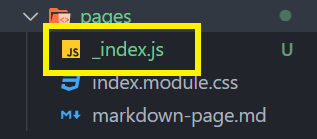

Docusaurus 會略過這個檔案的編譯，或者將 `./src/pages/` 底下的檔案都刪除也 OK。

這樣網頁的入口就會是文檔頁面囉 !

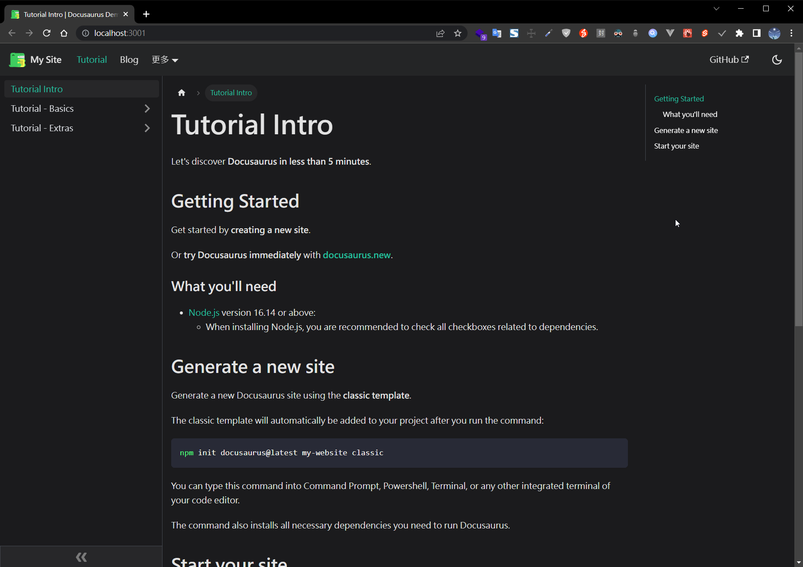

<br />

## Docs Front Matter

---

在 Markdown 的前言設置，例如 :

```markdown showLineNumbers
---
[Front Matter 內容]
---

...文件內容
```

在 `.md` 或 `.mdx` 文件頂部加上 `---` 包含設置內容，裡面會被解析為 YAML 格式。

在撰寫文件時，一般會常用到以下內容 :

```yaml showLineNumbers
---
id: [對應 url path] type: string
title: [文件標題] type: string
description: [對應 meta description] type: string
sidebar_label: [側邊攔顯示文字] type: string
sidebar_position: [側邊攔排序位置] type: number
tags: [文件標籤] type: array
---
```

[Docusaurus 官方對應表](https://docusaurus.io/docs/api/plugins/@docusaurus/plugin-content-docs#markdown-front-matter)

<br />

## 部署至 Vercel

---

如果想確認實際上線後整體網站的樣子，可以使用 `npm run build` 等待 build 完畢後，再使用 `npm run serve` 查看整個網站。

### Step 1. 登入 Vercel

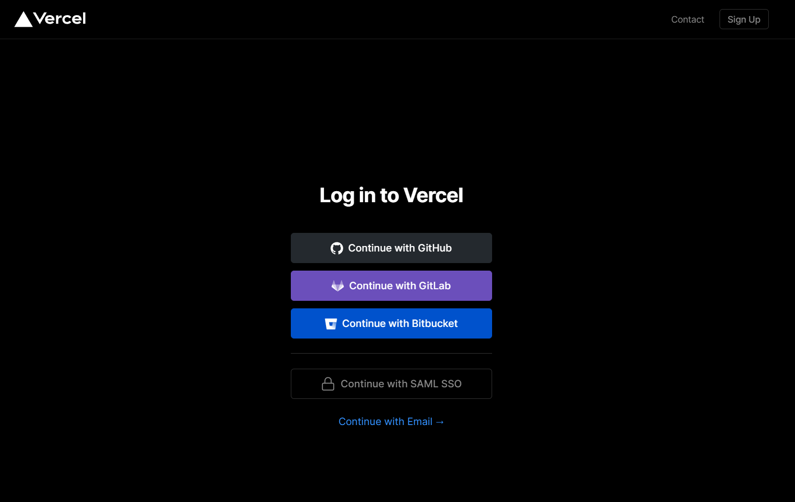

因為專案放在 GitHub 上，這邊使用 GitHub 登入。

### Step 2. 匯入 repo

點選右上 “Add New…”，選擇 Project。

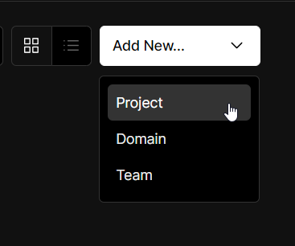

接著匯入已經上傳到 GitHub 的專案

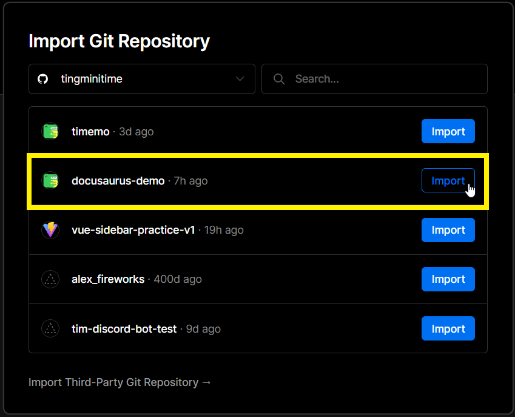

Vercel 很貼心的提供 Docusaurus 2 的基本配置，直接點擊部署就 OK 囉 !

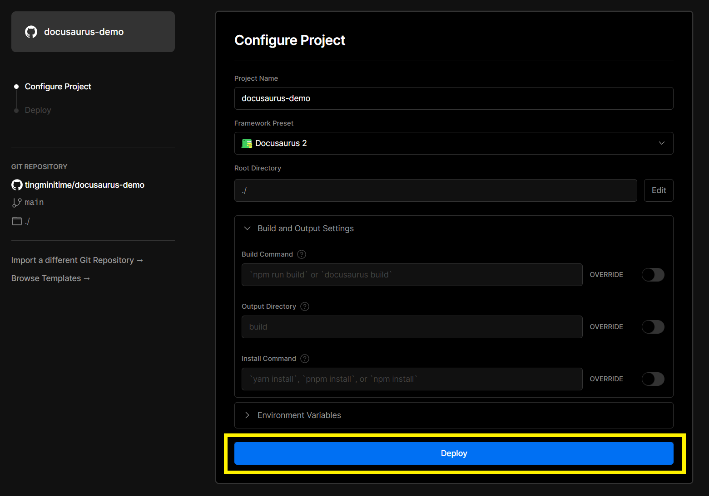

等待部署結束，就大功告成囉 !

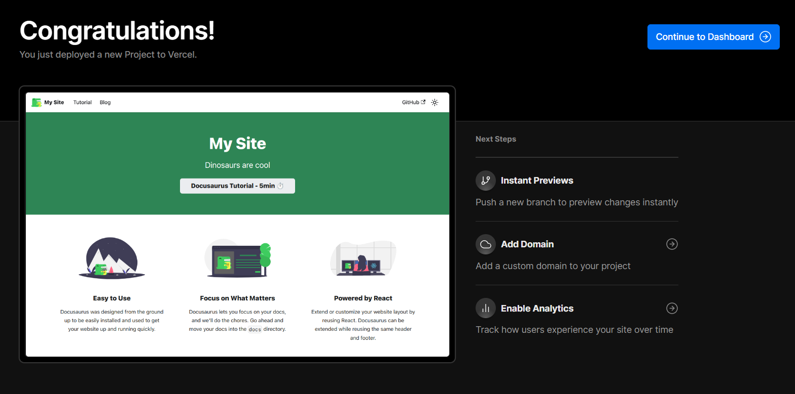

點擊圖示就可以查看上線的網站了 !

<br />

## VSCode 推薦擴充

---

- [Markdown All in One](https://marketplace.visualstudio.com/items?itemName=yzhang.markdown-all-in-one) : 方便的 markdown 自動完成語法，各種 markdown 撰寫實用功能。

<br />

## Reference

---

- [Build optimized websites quickly, focus on your content | Docusaurus](https://docusaurus.io/)
- [Introducing Docusaurus | Docusaurus](https://docusaurus.io/blog/2017/12/14/introducing-docusaurus)
- [Deployment | Docusaurus](https://docusaurus.io/docs/deployment)
- [【學習筆記】如何使用 Docusaurus & React 快速架設靜態網站](https://heidiliu2020.github.io/docusaurus-react-blog/)
- [Basic Syntax | Markdown Guide](https://www.markdownguide.org/basic-syntax/)
- [Extended Syntax | Markdown Guide](https://www.markdownguide.org/extended-syntax/)
