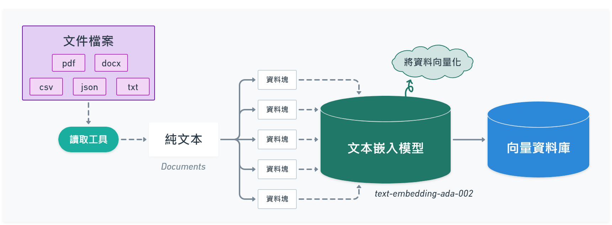

# LangChain

## Documents

- Concepts ( 文字說明文檔 ) : https://docs.langchain.com/docs/
- Python : https://python.langchain.com/docs
- JavaScript : https://js.langchain.com/docs

## 什麼是 LangChain ?

LangChain 是 Robust Intelligence 的前機器學習工程師 Chase Harrison 在 2022 年 10 月推出，一個集合許多基於大型語言模型 ( LLMs ) 相關功能模組的開發框架，可以串接 [OpenAI](https://openai.com/)、[HuggingFace](https://huggingface.co/) 等，透過不同功能模組之間的「鏈式」串接，開發出能讓大型語言模型實際且有策略執行任務的應用，簡單來說就是方便開發者快速建立 LLMs 應用的工具包。

LangChain 除了主要有 [Python](https://python.langchain.com/) 版本，也有提供 [JavaScript](https://github.com/hwchase17/langchainjs) 版本，JavaScript 版本基本上都和 Python 版本架構設計一樣，但有些模組功能和一些外部服務串接沒有 Python 版本完整。

:::info
LangChain 主要擁有兩種能力 : 
1. 讓 LLM 可以和外部資訊串接互動。 
2. 讓 LLM 與 LLM 之間彼此交互執行任務。
:::

## LangChain 文件問答流程

### **01 - 準備要問答的文件**

1. 載入文件 ( pdf、csv、docx、txt ... )，並將文件轉換成純文本。
2. 將文本切分成許多小區塊 ( chunk )，暫時稱它為**資料塊**。
3. 使用文本嵌入模型 ( Embedding Model )，將切分的資料塊轉換成多維向量資料，目的是為了方便在語意搜尋時，找出相似的結果資料。
4. 將向量化的資料塊儲存至向量資料庫 ( Vector Store )。

### **02 - 提問流程**

1. 詢問一個問題。
2. 經由大型語言模型 ( LLM ) 將對話記錄和新的問題組合成一個「獨立問題」。
3. 使用文本嵌入模型 ( Embedding Model )，將這個獨立問題轉換成向量資料。
4. 將向量化的獨立問題與向量資料庫比對搜索出相關的向量資料。
5. 搜索出相關的資料後，把這些資料和獨立問題「組合」在一起，並輸入 ( Input ) 給 LLM 給出最後的回答 ( Output )。

 

## Reference

---

- [🦜️🔗 LangChain](https://docs.langchain.com/docs/)
- [GPT-4 & LangChain Tutorial: How to Chat With A 56-Page PDF Document (w/Pinecone)](https://youtu.be/ih9PBGVVOO4)
- [利用LangChain實作ChatPDF：輕鬆快速與任何文件對話](https://edge.aif.tw/express-langchain-chatpdf/)
- [LangChain从入门到精通](https://www.zhihu.com/column/c_1632737846942478336)
- [成為大型語言模型開發者要面對的事](https://r23456999.medium.com/成為大型語言模型開發者要面對的事-46715fce482)
- [一篇文章搞懂LangChain](https://mp.weixin.qq.com/s/BvPBVN1BtxuQrqATDjAJvw)
- [LangChain 中文入门教程](https://liaokong.gitbook.io/llm-kai-fa-jiao-cheng/)
- [The Problem With LangChain | Max Woolf's Blog](https://minimaxir.com/2023/07/langchain-problem/)
