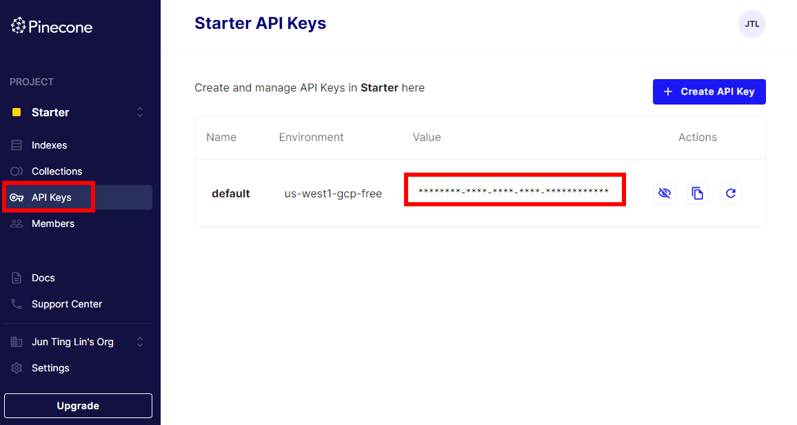
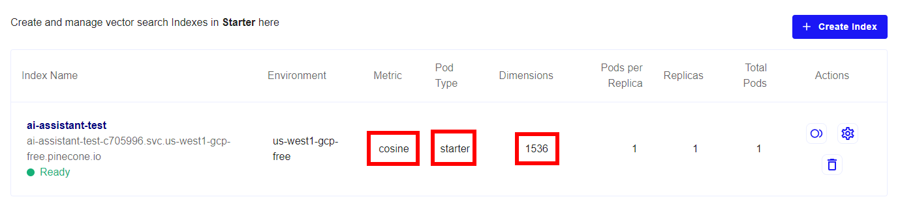
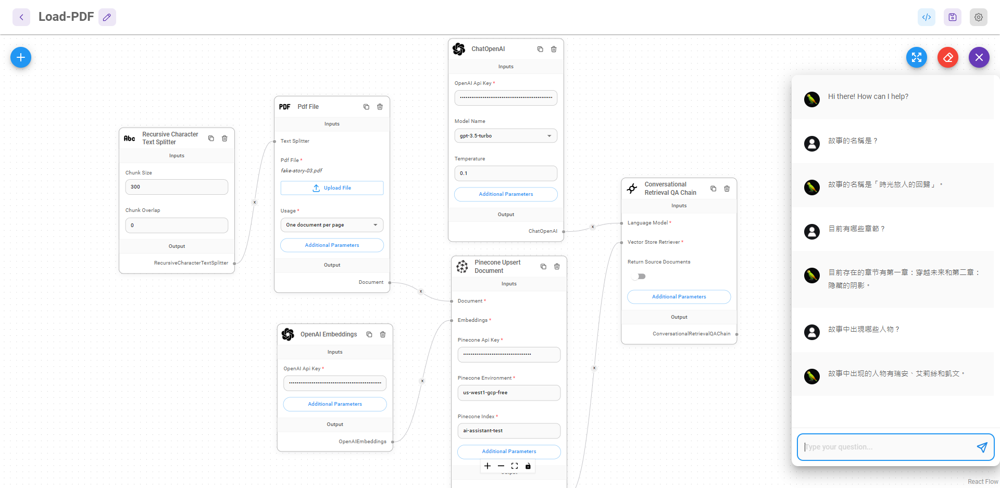

# LangChain + Node.js

## 前言

LangChain 是 Robust Intelligence 的前機器學習工程師 Chase Harrison 在 2022 年 10 月推出，一個集合許多基於大型語言模型 ( LLMs ) 相關功能模組的開發框架，可以串接 [OpenAI](https://openai.com/)、[HuggingFace](https://huggingface.co/) 等，透過不同功能模組之間的「鏈式」串接，開發出能讓大型語言模型實際且有策略執行任務的應用，簡單來說就是方便開發者快速建立 LLMs 應用的工具包。

LangChain 除了主要有 [Python](https://python.langchain.com/) 版本，也有提供 [JavaScript](https://github.com/hwchase17/langchainjs) 版本，JavaScript 版本基本上都和 Python 版本架構設計一樣，但有些模組功能和一些外部服務串接沒有 Python 版本完整。

目前 LangChain 還在很早期開發的階段，GitHub 上不管是 Python 還是 JavaScript 都有許多 Issue 待解決，官方文件也還不是很齊全，這篇筆記會嘗試用 Node.js 搭配 LangChain，針對自定義的 PDF 文件內容與 LLMs 進行對話。

:::info

<span>LangChain 主要擁有兩種能力 :</span>
<br />
1. 讓 LLM 可以和外部資訊串接互動。
<br />
2. 讓 LLM 與 LLM 之間彼此交互執行任務。
:::

## 制定目標

讀取 PDF 文件，提問與 PDF 文件內容有關的問題，或者針對 PDF 文件內容衍生話題，讓 AI 來與我對話。

## LangChain 的提問 → 回答架構流程

使用 LangChain 基本上會依照下圖流程設計開發。

[](./assets/langChain_process.png)

### 01 - 準備要問答的文件

1. 載入 PDF 文件，並將 PDF 文件轉換成純文本。
2. 將文本切分成許多小區塊 ( chunk )，暫時稱它為**資料塊** ( 後面有許多部份會提到 )。
3. 使用文本嵌入模型 ( Embedding Model )，將切分的資料塊轉換成多維向量資料，目的是為了方便在語意搜尋時，找出相似的結果資料。
4. 將向量化的資料塊儲存至向量資料庫 ( Vector Store )。

### 02 - 提問流程

1. 詢問一個問題。
2. 經由大型語言模型 ( LLM ) 將對話記錄和新的問題組合成一個「獨立問題」。
3. 使用文本嵌入模型 ( Embedding Model )，將這個獨立問題轉換成向量資料。
4. 將向量化的獨立問題與向量資料庫比對搜索出相關的向量資料。
5. 搜索出相關的資料後，把這些資料和獨立問題「組合」在一起，並輸入 ( Input ) 給 LLM 給出最後的回答 ( Output )。

:::info
文本的切分目的，是為了要解決文字輸入 GPT 語言模型時的 tokens 數量限制。
理想上我們會想將文件整個丟給 GPT 語言模型讀取，但實務上非常容易超過模型的 tokens 數量限制，因此要將文件的文字切小塊 ( 資料塊 )，在向 GPT 語言模型提問時，只將與問題有關聯的資料塊取出併入提問的上下文，才不容易因為 tokens 限制導致無法提問 ( Input )，同時也能降低、控制對話成本。
:::

### 選擇 Model

主要使用 `gpt-3.5-turbo` 節省成本。

| Model             | Input ( prompt )    | Output ( completion ) | Max Tokens |
| ----------------- | ------------------- | --------------------- | ---------- |
| gpt-3.5-turbo     | $0.0015 / 1K tokens | $0.002 / 1K tokens    | 4,096      |
| gpt-3.5-turbo-16k | $0.003 / 1K tokens  | $0.004 / 1K tokens    | 16,384     |
| gpt-4             | $0.03 / 1K tokens   | $0.06 / 1K tokens     | 8,192      |
| gpt-4-32k         | $0.06 / 1K tokens   | $0.12 / 1K tokens     | 32,768     |

Source : [https://openai.com/pricing](https://openai.com/pricing)

## 前置準備

### Server 端環境

- Node.js : v18
- langchain
- pdf-parse
- openai

### Vector Store - 向量資料庫

註冊 [Pinecone](https://www.pinecone.io/) 取得 API Key :



到 Indexes 按「Create Index」創建一個免費的向量資料庫，設定如下 :

- Metric : cosine
- Pod Type : starter
- Dimensions : 1536 ( 向量維度，OpenAI 的 [text-embedding-ada-002](https://platform.openai.com/docs/guides/embeddings/second-generation-models) 嵌入模型提供 1536 維度的輸出 )



## 撰寫程式碼

> GitHub Repo : https://github.com/tingminitime/vue-ai-loader-assistant

程式碼邏輯基本上和上面提到的流程相同。

### 01 - 準備文件問答邏輯


首先，使用 LangChain 可以先關注再如何準備、處理文件。

#### 1. 載入 PDF 文件

這邊使用 ChatGPT 產出一個大約 3 頁 A4 紙的故事來當文件。( <a href="https://github.com/tingminitime/vue-ai-loader-assistant/blob/main/server/docs/fake-story-02.pdf" target="_blank" rel="noreferrer noopenner">fake-story-03.pdf</a> )

<details>
  <summary>故事內容 ( 約 2600 字 )</summary>
  <p>故事名稱：時光旅人的回歸

1.　人物背景：

a. 主角 - 瑞安 (Ryan)：

- 背景：瑞安是一位年輕的物理學家，研究時間旅行理論的專家。他在 2023 年畢業於著名的洛克哈特大學，以優異成績取得博士學位。自小對科學充滿著無限的好奇心，他長大後專注於時間旅行的研究，希望能夠解開這個宇宙的最大謎團之一。

b. 重要配角 - 艾莉絲 (Alice)：

- 背景：艾莉絲是一位出色的歷史學家，同時也是一名時間旅行愛好者。她在歷史文化研究上擁有卓越的成就，對於不同年代的文化、藝術和社會變遷都有深入的了解。她經常與瑞安合作，共同探討時間旅行的可能性。

2.　故事描述：

在一個寧靜的夏日午後，瑞安和艾莉絲坐在洛克哈特大學的圖書館裡，討論著關於時間旅行的理論。他們共同懷抱著探索過去和未來的夢想，渴望能夠突破時間的壁壘。

正當他們對於時間旅行的可能性越來越興奮時，突然，圖書館的角落出現了一本古老的書籍。這本書籍是一本神秘的時間旅行日記，記錄著一位古老的時光旅人的冒險故事。

瑞安和艾莉絲決定進一步研究這本日記，他們在數天之內讀完了這位時光旅人的所有紀錄。這位時光旅人名為艾德華 (Edward)，是一位生活在 19 世紀的科學家。艾德華是時間旅行理論的先驅者之一，但他的研究遭到了當時社會的嘲笑和不信任。

艾德華的日記中描述了他成功進行一次時間旅行的經歷，他穿越到未來的世界，目睹了科技的巨大進步和人類文明的變遷。然而，艾德華在回到自己的時代後，卻發現無法再次進行時間旅行，並失去了對未來的記憶。

瑞安和艾莉絲被這個故事深深吸引，他們決定重現艾德華的實驗，嘗試進行一次時間旅行。他們運用瑞安的物理學知識和艾莉絲的歷史研究，展開了一個驚險而令人興奮的實驗。

經過了長時間的努力和嘗試，他們終於成功了！瑞安和艾莉絲穿越到了一個未來的世界，他們看到了驚人的科技、繁榮的社會和美麗的藝術。然而，他們也發現這個未來的世界面臨著嚴重的環境危機和社會不平等問題。

瑞安和艾莉絲在這個未來的世界中度過了一段時間，他們與當地的人民交流，深入了解了這個世界的現狀。他們認識到，雖然時間旅行帶來了許多新奇和驚人的體驗，但最重要的還是回到自己的時代，把這些所見所聞和經驗與世人分享，以期對未來的發展產生積極的影響。

瑞安和艾莉絲決定結束這次旅程，回到他們的時代，並將自己的冒險故事寫成書籍，以啟發和鼓勵更多的人關注環境保護和社會公平。他們成為了時間旅行的先驅者，開啟了一個新的時代，人們開始思考並行動起來，為創造更美好的未來而努力。

故事尚未結束，瑞安和艾莉絲的冒險故事正等待著更多的人們來發現和書寫，因為時間旅行的奧秘將永遠吸引著人們尋找答案，並探索未知的可能性。

第一章：穿越未來

在瑞安和艾莉絲成功進行時間旅行的驚人時刻後，他們身處於一個陌生而令人驚嘆的未來世界。他們的眼前展開了一幅科技高度發達且富有創意的畫面，這個未來是在公元 2060 年。

這個未來世界中，建築物高聳入雲，交通系統充滿了先進的飛行汽車和高速磁浮列車。城市的每個角落都散發著節能環保的璀璨光芒，清澈的河流與蓊鬱的公園環繞著現代化的建築群。

瑞安和艾莉絲的好奇心驅使他們探索這個未來世界。他們遇到了一位名叫凱文（Kevin）的當地居民，一位擁有深厚科學知識和對未來社會發展的熱情的年輕科學家。凱文引導著瑞安和艾莉絲穿梭在這個未來城市的各個角落，向他們展示了令人震撼的科技創新和社會進步。

在他們的冒險旅程中，他們參觀了一個高科技的能源中心，這個中心利用太陽能、風能和地熱能來為整個城市提供清潔能源。他們還參觀了一個由機器人和人工智能控制的智慧家庭，這裡的居民享受著智慧化的生活，從居家自動化到個人助理。

然而，隨著探索的深入，瑞安、艾莉絲和凱文逐漸意識到，這個未來世界雖然擁有許多令人羨慕的科技和環境成就，但也面臨著一些重大的挑戰。社會不平等問題依然存在，有些人仍然無法享受到科技進步所帶來的福祉。此外，由於全球資源的壓力和人口增長，仍有許多環境問題需要解決。

凱文提議他們探訪一個名為「和平之園」的社區，這裡的居民致力於實現環境和諧、社會平等的理念。瑞安、艾莉絲和凱文在這個社區中見證了人與自然和諧共存的美景，他們也與居民們交流，聽取他們對未來發展的想法和努力。

這次冒險讓瑞安和艾莉絲深刻體會到，科技的進步和社會的平等並非僅僅靠技術本身就能實現，而需要人們的共同努力和價值觀的轉變。他們決定回到自己的時代，將這段難以置信的經歷和所見所聞與世人分享，激勵更多人關注環境議題和追求社會公平。

凱文也加入了瑞安和艾莉絲的旅行團隊，他們一同返回現在，帶著對未來的希望和改變的決心。他們決定將他們的冒險故事寫成書籍，並以講演和工作坊的形式，分享他們所見所聞，啟發更多人投入到創造可持續發展的未來中去。

故事將繼續，瑞安、艾莉絲和凱文將展開新的冒險，探索更多時光旅行的可能性，並為創造更美好的未來而努力。

( 故事第一章 - 完 )

第二章：隱藏的陰影

瑞安、艾莉絲和凱文返回自己的時代後，他們被前往未來的冒險所深深吸引，他們開始籌劃著下一次的時光旅行。經過精心準備，他們再次穿越到了未來的世界，這次他們來到了公元 2075 年。

在這個未來的世界，科技和社會變革取得了更為驚人的進步。城市變得更加智慧化和綠化，人們享受著高品質的生活。然而，這個看似完美的未來卻隱藏著一些不尋常的陰影。

瑞安、艾莉絲和凱文進一步探索這個未來世界，他們發現社會的控制程度明顯增加，個人自由受到了限制。政府擁有強大的監控系統，個人隱私逐漸被侵蝕，人們被迫遵守嚴格的規定和行為準則，缺乏了自由表達和獨立思考的空間。

瑞安、艾莉絲和凱文進行了一系列的調查和探索，他們深入暗處，尋找背後的真相。他們遇到了一個地下組織，這個組織致力於保護個人自由和平等的價值，組織成員告訴他們，這個未來的社會由於某些事件的發生，政府開始以安全為名大幅度擴張權力，限制個人權利。

瑞安、艾莉絲和凱文深感危機，他們決定加入這個地下組織，以揭露政府的陰謀，恢復人民的自由。他們進行了訓練，學習各種技能和策略，為進行一場改變未來的戰鬥做好準備。

在瑞安、艾莉絲和凱文的領導下，地下組織開展了一系列抵抗行動，他們利用科技手段來破解政府的監控系統，散播真相，喚醒人們的意識。他們帶領著人民走上街頭，舉行和平示威，要求政府恢復人民的權利和自由。

然而，隨著戰鬥的激烈進行，他們面臨著越來越大的阻力和危險。政府部隊展開了嚴密的監控和追捕，他們必須躲避追捕，同時尋找關鍵的證據和支持者。

故事將繼續，瑞安、艾莉絲、凱文和地下組織的成員將面臨著生死存亡的關鍵時刻。他們的使命是改變未來，重建一個自由平等的社會。

( 故事第二章 - 完 )
  </p>
</details>

然後使用 langchain 提供的 PDFLoader  加載文件並解析 : 

```tsx showLineNumbers title="./server/script/ingest-data.js"
import { PDFLoader } from 'langchain/document_loaders/fs/pdf'

const filePath = './docs/fake-story-03.pdf' // /docs 目錄底下的 pdf 文件
const pdfLoader = new PDFLoader(filePath) // 載入 PDF 文件並實例化
const rawPDFDocs = await pdfLoader.load() // 解析 PDF 文件
```

此時的 `rawDocs` 內容大概是長這樣 : 

```json
[
  {
    "pageContent": "故事名稱：時光旅人的回歸\n \n \n ...(省略)",
    "metadata": {
      "source": "./docs/fake-story-03.pdf",
      "pdf": {
        "version": "1.10.100",
        "info": {
          "PDFFormatVersion": "1.5",
          "IsAcroFormPresent": false,
          "IsXFAPresent": false,
          "Author": "xxx",
          "Creator": "Microsoft® Word 2016",
          "Producer": "Microsoft® Word 2016",
          "CreationDate": "D:20230705143756+08'00'",
          "ModDate": "D:20230705143756+08'00'"
        },
        "metadata": null,
        "totalPages": 3
      },
      "loc": {
        "pageNumber": 1
      }
    }
  },
  // ...(省略)
],
```

其中 `pageContent` 會包含 PDF 文件裡面所有的文字，但如果直接把這麼多的文字餵給 LLM 會容易超過 token 數量限制 ( `gpt-3.5-turbo` max tokens : 4,097 )，因此需要將這些文字切分成許多小文字區塊 ( chunk )。

#### 2. 將文字切分成許多小資料區塊 ( chunk )

在這部分主要有兩個需要設定的地方 : 

- `chunSize` : 每個文字區塊最多幾個字數。
- `chunkOverlap` : 下一個資料塊的開頭重疊上一個資料塊的尾段字數。

以上兩個設定需看文件內容多寡、性質而定。

切分的方法主要會使用 `RecursiveCharacterTextSplitter` 來切分資料塊，比 `CharacterTextSplitter` 方法更嚴謹 : 

- `CharacterTextSplitter` : 以 `"\n\n"` 為基準進行切塊，但不嚴謹，資料塊可能會超過 `chunkSize`。
- `RecursiveCharacterTextSplitter` : 以 `"\n\n"`、`"\n"`、`" "`、`""` 為基準進行切塊，較為嚴謹，會嚴格限制每個區塊在 `chunkSize` 內。

```tsx showLineNumbers title="./server/script/ingest-data.js"
const splitter = new RecursiveCharacterTextSplitter({
  chunkSize: 300,
  chunkOverlap: 0
})

const pdfDocs = await splitter.splitDocuments(rawDocs)
console.log(`Split ${docs.length} documents.`) // 可以印出切了多少個資料塊
```

#### 3. 使用文本嵌入模型 ( Embedding Model )，將資料塊轉換成多維向量資料，再儲存到向量資料庫

在這個步驟前須要先準備一個 `.env` 環境檔，並包含 OpenAI API Key 和 Pinecone 的 API Key、Index name、Enviroment : 

```bash title=".env"
OPENAI_API_KEY= # OpenAI API Key
PINECONE_API_KEY= # Pinecone API Key
PINECONE_INDEX= # Pinecone Index Name ( e.g. ai-assistant-test )
PINECONE_ENVIRONMENT= # Pinecone Index Environment (e.g. us-west1-gcp-free)
```

因為在後面提問流程還會用到 Pinecone 相同的串接邏輯，因此寫一個 `usePinecone.js` 使用 : 

```tsx showLineNumbers title="./server/script/ingest-data.js"
import { PineconeStore } from 'langchain/vectorstores/pinecone'
import { PineconeClient } from '@pinecone-database/pinecone'
import dotenv from 'dotenv'

dotenv.config()

/**
 * Returns pineconeIndex and PineconeStore
 * @returns {object} { pineconeIndex, PineconeStore }
 */
export default async function usePinecone() {
  const pineconeClient = new PineconeClient()
  await pineconeClient.init({
    apiKey: process.env.PINECONE_API_KEY,
    environment: process.env.PINECONE_ENVIRONMENT
  })

  const pineconeIndex = pineconeClient.Index(process.env.PINECONE_INDEX_NAME)

  return {
    pineconeIndex,
    PineconeStore
  }
}
```

如此一來就可以完成準備問答文件的整理邏輯 : 

```tsx showLineNumbers title="./server/script/ingest-data.js"
import { PDFLoader } from 'langchain/document_loaders/fs/pdf'
import { RecursiveCharacterTextSplitter } from 'langchain/text_splitter'
import { OpenAIEmbeddings } from 'langchain/embeddings/openai'
import dotenv from 'dotenv'
import usePinecone from '../utils/pinecone/usePinecone.js'

dotenv.config() // 載入 .env 環境變數

const { pineconeIndex, PineconeStore } = await usePinecone()

// ===== 載入文件 =====
const filePath = './docs/fake-story-02.pdf' // PDF文件路徑
const pdfLoader = new PDFLoader(filePath)
const rawPDFDocs = await pdfLoader.load()

// ===== 將文件切塊 =====
const splitter = new RecursiveCharacterTextSplitter({
  chunkSize: 300,
  chunkOverlap: 0
})

const pdfDocs = await splitter.splitDocuments(rawPDFDocs)
console.log(`Split ${pdfDocs.length} documents.`)

// ===== 資料塊轉換成多維向量，儲存至資料庫 =====
try {
  PineconeStore.fromDocuments(pdfDocs, new OpenAIEmbeddings(), {
    pineconeIndex,
    textKey: 'text', // default
    namespace: 'fake-story-03'
  })
} catch (err) {
  console.error(err)
}
```

依照 LangChain 提供各種向量資料庫的方法，例如這邊使用 Pinecone，LangChain 就有提供 `fromDocuments` 方法，可以將資料塊轉換成多維向量資料並儲存至 Pinecone 資料庫。

需要留意的是，OpenAIEmbeddings 方法會使用到 OpenAI API Key，使用 [text-embedding-ada-002](https://platform.openai.com/docs/guides/embeddings) 這個嵌入模型，不過這個模型的計費較低，1000 個 tokens 費用是 0.0001 美金。

> 參考文件 : 
[LangChain  JS/TS Docs - Components/Indexes/Vector Stores/Integrations/Pinecone](https://js.langchain.com/docs/modules/indexes/vector_stores/integrations/pinecone)
>

### 02 - 提問流程邏輯


#### 1. 串接 OpenAI 設定

```tsx showLineNumbers title="./server/chatHandler.js"
import { ConsoleCallbackHandler } from 'langchain/callbacks'
import { OpenAI } from 'langchain/llms/openai'
import { OpenAIEmbeddings } from 'langchain/embeddings/openai'
import dotenv from 'dotenv'
import usePinecone from './utils/pinecone/usePinecone.js'

dotenv.config() // 載入 .env 環境變數

// OpenAI 模組會使用到 OpenAI API key
const model = new OpenAI({
  temperature: 0.1, // In LangChain default is 0.7
  modelName: 'gpt-3.5-turbo-0613', // In LangChain defaults is "text-davinci-003"
  callbacks: [new ConsoleCallbackHandler()],
})

```

這個步驟主要在 OpenAI 模組裡撰寫 API 相關串接設定 : 

- `temperature` : AI 回答的隨機性。
- `modelName` : 語言模型名稱，預設是 `gpt-3.5-turbo`。
- `callbacks` : 模型調用會執行的函式，詳細可以參考[官方文件](https://js.langchain.com/docs/production/callbacks/)，這裡用 `ConsoleCallbackHandler` 方便在終端機查看模型調用事件紀錄。

:::info
LangChain 的 `OpenAI` 模組可換成 `ChatOpenAI` 模組 ( `import { ChatOpenAI } from 'langchain/chat_models/openai'` )，兩種模組都能使用 `gpt-3.5-turbo-0613` 模型。
:::

#### 2. Pinecone 資料庫實例化，準備給後續對話的索引查詢相關資料使用

基本上和前面準備文件問答邏輯最後使用到的 `fromDocuments` 類似，但不做資料儲存動作，指實例化資料庫。

```tsx showLineNumbers title="./server/chatHandler.js"
const { pineconeIndex, PineconeStore } = await usePinecone()

const pineconeStore = await PineconeStore.fromExistingIndex(
  new OpenAIEmbeddings(),
  {
    pineconeIndex,
    textKey: 'text', // default
    namespace: 'fake-story-03',
  },
)
```

#### 3. 對話鏈實例化

`ConversationalRetrievalQAChain` 方法是提供有對話紀錄功能的模組，調用這個模組時，它會將歷史對話紀錄與新的問題組合成一個「獨立問題」，再利用檢索器 ( Retriever ) 在向量資料庫中搜尋與這個「獨立問題」相關的資料塊，再將這些相關的資料塊根據不同的 [Chain Type](https://www.notion.so/Chain-Type-5faeb584240841dbab7e228cf19412b2?pvs=21) 方法進行摘要組合後，與「獨立問題」組合提交給 LLM 詢問，是提問流程中最核心的模組。

:::info
不同的 Chain Type 會影響使用 token 的數量，需針對文件內容多寡、性質和預估對話產生的費用選擇適合的 Chain Type。
:::

```tsx showLineNumbers title="./server/chatHandler.js"
import { ConversationalRetrievalQAChain } from 'langchain/chains'
import { QA_GENERATOR_PROMPT, QA_PROMPT } from './utils/prompt.js'

const chain = ConversationalRetrievalQAChain.fromLLM(
  model,
  pineconeStore.asRetriever(4), // k值預設為4，代表回傳前k個最相似的文件
  {
    memory: new BufferMemory({
      memoryKey: 'chat_history',
      inputKey: 'question',
      outputKey: 'text',
      returnMessages: true,
    }),
    questionGeneratorTemplate: QA_GENERATOR_PROMPT,
    qaChainOptions: {
      type: 'stuff', // Chain Type
      prompt: PromptTemplate.fromTemplate(QA_PROMPT),
    },
    callbacks: [new ConsoleCallbackHandler()], // 印出對話鏈事件紀錄
    returnSourceDocuments: false, // 若設定為 true，會回傳資料庫中查詢到的文件
  },
)
```

其中 `memory` 使用 `BufferMemory` 紀錄下所有對話紀錄，提供給組合獨立問題 Prompt 中使用，要注意的是，使用 `ConversationalRetrievalQAChain` 對話鏈方法必須要指定 `memoryKey` 為 `chat_history` 才可以匹配組合成獨立問題的 Prompt 模板不會出錯。

因為 `BufferMemory` 會記錄所有歷史對話，當對話一多容易消耗太多的 tokens 導致費用增加，因此除了一般的 BufferMemory，還有以下幾種記錄對話的方法可以參考 : 

- `BufferWindowMemory` : 根據 `k` 值指定記憶最後幾筆來回對話，可在一定程度上限制 token 的消耗。
- `ConversationSummaryMemory` : 對當前對話進行摘要後再將摘要總結放進歷史紀錄，減少 token 的消耗。
- 其他還有將對話歷史紀錄儲存在 Redis、向量資料庫等方法實現對話歷史紀錄的持久化。

上面提到 Prompt 模板，LangChain 的對話鏈模組會提供預設英文的 Prompt 模板 : 

- [Python ( GitHub )](https://github.com/hwchase17/langchain/tree/master/libs/langchain/langchain/chains/question_answering)
- [JavaScript ( GitHub )](https://github.com/hwchase17/langchainjs/tree/main/langchain/src/chains/question_answering)

如果載入的是中文的文件，建議自訂中文的 Prompt 模板，並在 `questionGeneratorTemplate` 和 `qaChainOptions` 設定中放入兩種類型的 Prompt 模板，參考如下 : 

```tsx showLineNumbers title="./server/utils/prompt.js"
// 讓 AI 依照歷史對話紀錄和新的問題組合成一個獨立問題的 Prompt
export const QA_GENERATOR_PROMPT = `給定以下對話紀錄和一個後續問題，總結對話紀錄成摘要，若摘要與後續問題相關，請重新描述為一個獨立問題。
對話紀錄:
{chat_history}
後續問題: {question}
獨立問題:
`

// 含有相關資料組合的內容(context)和獨立問題(question)的 Prompt
export const QA_PROMPT = `你是一個懂中文且有用的 AI 助手，請使用以下上下文訊息並以繁體中文回答最後的問題，如果你不知道答案，只需要說你不知道，不要試圖猜測、編造答案；如果問題與上下文無關，請禮貌回答「我只能回答相關問題」。

{context}

問題: {question}
回答:
`
```

`ConversationalRetrievalQAChain` 模組會將雙括號 `{ }` 裡面的字轉換成 key，在組合成獨立問題時和詢問問題時會將這個 key 放入對應的值 : 

- 組合成獨立問題
    - `{chat_history}` : 對話歷史紀錄內容，會用 `\n` 組合對話紀錄字串。
    - `{question}` : 新的提問內容。
- 詢問問題
    - `{context}` : 在向量資料庫中搜尋到的相關資料，每筆資料間使用 `\n\n` 組合成的字串內容，然後儲存到這個 key。
    - `{question}` : 如果是第一次提問，會是提問內容；若有歷史對話紀錄，會是「組合成獨立問題」階段產出的「獨立問題」。

:::caution
( 2023/07/07 ) 目前 LangChainJS 的 Chain Type 使用 `stuff` 較為穩定，嘗試用 `map_reduce` 和 `refine` 都會遇到自訂 Prompt 模板無法覆蓋預設 Prompt 模板的問題，由於預設 Prompt 都是英文，容易遇到回答不準確的問題。
:::

#### 4. 提問範例

在上面第 3 步驟已經成功把對話鏈設定好了，這時可以參考上面的故事內容，先嘗試問個問題 : 

```tsx showLineNumbers
const answer = await chain.call({
  question: '故事的名稱是?',
})

console.log(answer)
```

如果在對話鏈有加入 `new ConsoleCallbackHandler()` 設定，可以在終端機看到從提問到回答中間的完整過程 ( 提問 → 組合獨立問題 → 提供有上下文的 Prompt 模板 → 回答 )。

這時的 `answer` 應該會印出 : 

```tsx
{ text: '故事的名稱是「時光旅人的回歸」。' }
```

AI 回答的沒錯，接下來嘗試連續提問 : 

```tsx showLineNumbers
const questions = [
  '故事的名稱是?',
  '目前有哪些章節?',
  '故事中出現哪些人物?',
  '瑞安、艾莉絲、凱文這三個人的關係是什麼?',
]

async function askMultipleQuestions(questions) {
  const chatChain = []
  for (let i = 0; i < questions.length; i++) {
    const chatChainItem = await chain.call({
      question: questions[i],
    })
    chatChain.push({
      question: questions[i],
      answer: chatChainItem.text,
    })
  }
  return chatChain
}

const chatChainRes = await askMultipleQuestions(questions)
console.log('chatChainRes: ', chatChainRes)
```

得到的回答如下 : 

```tsx
[
  {
    "question": "故事的名稱是?",
    "answer": "故事的名稱是「時光旅人的回歸」。"
  },
  {
    "question": "目前有哪些章節?",
    "answer": "這個故事有兩個章節，分別是第一章「穿越未來」和第二章「隱藏的陰影」。"
  },
  {
    "question": "故事中出現哪些人物?",
    "answer": "故事中出現了以下人物：\n1. 瑞安 (Ryan) - 主角，年輕的物理學家，研究時間旅行理論的專家。\n2. 艾莉絲 (Alice) - 重要配角，出色的歷史學家和時間旅行愛好者。\n3. 凱文 (Kevin) - 地下組織的成員，加入了瑞安和艾莉絲的旅行團隊。"
  },
  {
    "question": "瑞安、艾莉絲、凱文這三個人的關係是什麼?",
    "answer": "瑞安、艾莉絲和凱文是故事中的主要角色，他們是一個團隊，一起進行冒險和探索未來世界的旅程。他們共同加入地下組織，揭露政府的陰謀，並努力創造更美好的未來。"
  }
]
```

看起來回答的都算準確，到這邊算是將 LangChain 框架的主要流程跑過一遍。

:::info
*如果 AI 的回答準確度較低，可以嘗試調整 `chunkSize`、`chunkOverlap`、Retriever 的 `k` 值 ( 搜尋相關文件的數量 )，以及調整提示詞 ( prompt )。*
:::

## Flowise

[Flowise](https://flowiseai.com/) 是基於 LangChainJS 的 UI 可視化工具，不用撰寫任何一行程式碼就能開發出語言模型串接應用，也可以很方便實驗參數、修改 Prompt 等，安裝步驟可參考 [Flowise 官方文件](https://docs.flowiseai.com/getting-started)。



## 總結

LangChain 這套框架目前還不夠成熟，因為官方文件不齊全、範例過時，時常會需要翻原始碼解決遇到的問題，像是預設提示詞如何覆蓋、對話紀錄是怎麼儲存之類的，甚至有人認為 LangChain 把簡單的事情變得更複雜了，這些也都是在我測試 LangChain 實際有體會到的。

不過雖然受到社群很多質疑，但 LangChain 出現到現在也還不到一年，而且是聲量非常大的開源 AI 應用框架，實際跑過 LangChain 主要流程後，也能更明白 AI 實際使用上的眉眉角角，包括模型的選擇、文件的切分方式、提示詞的調整等，因此我認為 LangChain 還是值得繼續保持關注的。

<br />

## Reference

---

- [实现一个 AI 聊天机器人 LangChain & OpenAI](https://youtu.be/u3yn4UiL6-s)
- [Getting Started with LangChain | JavaScript Tutorial #1](https://www.youtube.com/watch?v=W3AoeMrg27o)
- [OpenAI Platform](https://platform.openai.com/docs/guides/embeddings/what-are-embeddings)
- [OpenAI Platform](https://platform.openai.com/docs/api-reference/chat/create)
- [OpenAI Platform](https://platform.openai.com/docs/models/model-endpoint-compatibility)
- [使用 LangChain 开发 LLM 应用（3）：记忆（Memory） - 掘金](https://juejin.cn/post/7243252896392839225)
- [FlowiseAI - Build LLMs Apps Easily](https://flowiseai.com/)
- [Welcome to Flowise](https://docs.flowiseai.com/)
